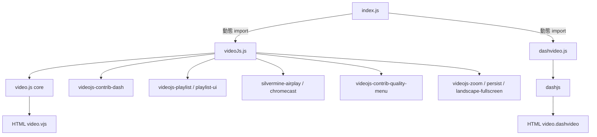
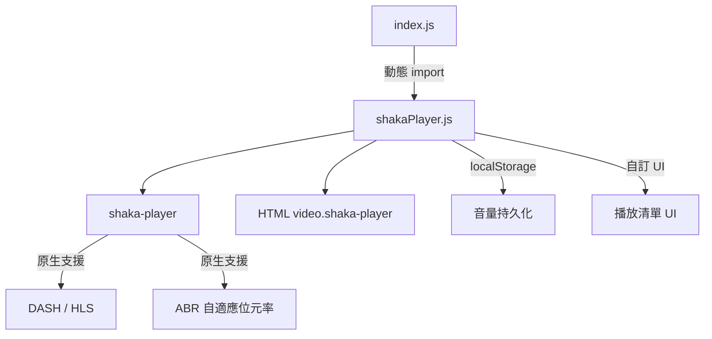
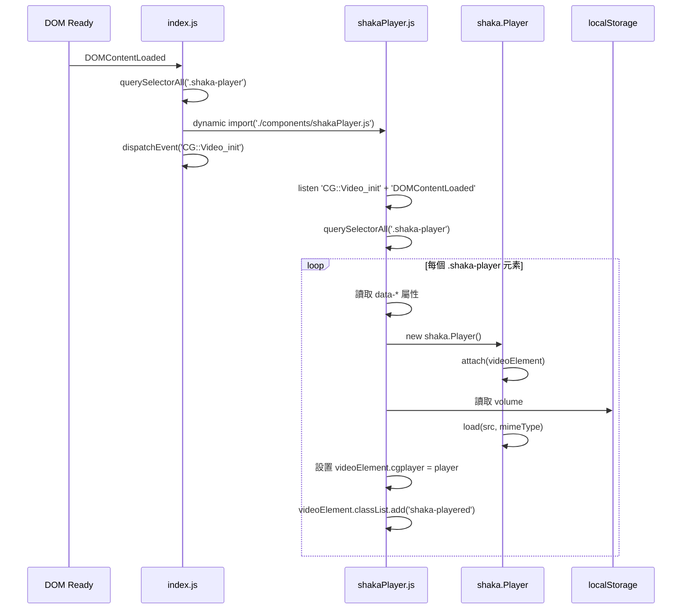

# Design Document: Shaka Player Migration

## Overview

本專案將現有的 video.js 播放器（含所有相關插件）以及 dashjs 完全替換為 Google Shaka Player 5.x。Shaka Player 是 Google 開源的自適應串流媒體播放器，原生支援 DASH 與 HLS，無需額外插件，大幅減少依賴數量與 bundle 體積。

遷移目標是在保持現有 `data-*` 屬性 API 完全向後相容的前提下，以 Shaka Player 重新實作所有播放功能，包含 DASH 串流、音量持久化、自動播放、poster 圖片、播放清單等，並同步更新所有 Blade 模板的 class 名稱與 CSS 樣式。

---

## Architecture

### 現有架構（遷移前）



### 目標架構（遷移後）



### 主要流程



---

## Components and Interfaces

### Component 1: `shakaPlayer.js`

**Purpose**: 取代 `videoJs.js` 與 `dashvideo.js`，成為唯一的播放器初始化模組。

**Interface**（TypeScript 風格描述）:

```typescript
interface ShakaPlayerConfig {
  src: string;                    // data-src
  width?: string;                 // data-width（支援 % 與 px）
  height?: string;                // data-height（支援 % 與 px）
  controls?: boolean;             // data-controls（預設 true）
  autoplay?: boolean;             // data-autoplay（預設 false）
  preload?: 'none' | 'metadata' | 'auto'; // data-preload（預設 'none'）
  type?: 'normal' | 'dash';       // data-type（預設 'normal'）
  minetype?: string;              // data-minetype（預設 'video/mp4'）
  poster?: string;                // data-poster（預設 base64 logo）
  title?: string;                 // data-title（預設 '影片'）
  persist?: boolean;              // data-persist（音量持久化）
  landscapeFullscreen?: boolean;  // data-landscapeFullscreen
  chromecast?: boolean;           // data-chromecast（保留 flag，Shaka 原生支援）
  zoom?: boolean;                 // data-zoom（保留 flag）
  airplay?: boolean;              // data-airplay（保留 flag，Shaka 原生支援）
  playerlist?: boolean;           // data-playerlist
  playerlistjson?: string;        // data-playerlistjson（JSON 字串）
}

interface ShakaPlayerInstance {
  cgplayer: shaka.Player;         // 掛載於 videoElement.cgplayer
}
```

**Responsibilities**:
- 掃描所有 `.shaka-player` 元素
- 解析 `data-*` 屬性並建立 `ShakaPlayerConfig`
- 初始化 `shaka.Player` 並 attach 到 `<video>` 元素
- 處理 DASH（`application/dash+xml`）與一般 MP4/HLS 串流
- 從 `localStorage` 讀取並套用音量（`persist` 模式）
- 監聽音量變更並寫入 `localStorage`
- 初始化後設置 `videoElement.cgplayer = player` 與 `videoElement.classList.add('shaka-playered')`
- 監聽 `CG::Video` 與 `CG::Video_init` 事件以支援動態載入場景

### Component 2: `index.js`（修改）

**Purpose**: 更新動態 import 邏輯，偵測 `.shaka-player` 元素而非 `.vjs`。

**修改點**:
```typescript
// 舊
if (document.querySelectorAll('.vjs').length > 0) {
    import('./components/videoJs.js').then(() => {
        document.dispatchEvent(new CustomEvent('CG::Video_init'));
    });
}

// 新
if (document.querySelectorAll('.shaka-player').length > 0) {
    import('./components/shakaPlayer.js').then(() => {
        document.dispatchEvent(new CustomEvent('CG::Video_init'));
    });
}
```

### Component 3: Blade 模板（修改）

**Purpose**: 更新所有 `<video>` 元素的 class 名稱，移除 video.js 特定 class。

**Class 對應表**:

| 舊 class | 新 class | 說明 |
|----------|----------|------|
| `vjs` | `shaka-player` | 主要觸發 class |
| `video-js` | 移除 | video.js 專屬 |
| `vjs-theme-forest` | 移除 | video.js 主題 |
| `vjsed`（JS 動態加入） | `shaka-playered` | 初始化完成標記 |

**`data-*` 屬性保持不變**（完全向後相容）。

---

## Data Models

### Model 1: 播放器狀態（localStorage）

```typescript
interface PersistedPlayerState {
  volume: number;  // 0–100，整數，key: 'volume'
}
```

**Validation Rules**:
- `volume` 必須為 0–100 之間的整數
- 讀取時若 `localStorage.getItem('volume')` 為 null，使用瀏覽器預設音量

### Model 2: 播放清單項目

```typescript
interface PlaylistItem {
  src: string;
  type?: string;
  poster?: string;
  title?: string;
}
```

**Validation Rules**:
- `src` 必須為非空字串
- `type` 若為 DASH 則為 `'application/dash+xml'`

---

## Algorithmic Pseudocode

### 主要初始化演算法

```pascal
ALGORITHM initShakaPlayers()
INPUT: DOM 中所有 .shaka-player 元素
OUTPUT: 每個元素均已初始化 shaka.Player

BEGIN
  ASSERT shaka.Player.isBrowserSupported() = true
  
  elements ← document.querySelectorAll('.shaka-player')
  
  FOR each element IN elements DO
    ASSERT element IS HTMLVideoElement
    
    IF element.classList.contains('shaka-playered') THEN
      CONTINUE  // 避免重複初始化
    END IF
    
    config ← parseDataAttributes(element)
    
    IF config.src = undefined THEN
      CONTINUE
    END IF
    
    player ← new shaka.Player()
    player.attach(element)
    
    applyPlayerConfig(element, player, config)
    
    TRY
      load(player, config)
    CATCH error
      console.error('Shaka load error', error)
    END TRY
    
    element.cgplayer ← player
    element.classList.add('shaka-playered')
  END FOR
END
```

### 屬性解析演算法

```pascal
ALGORITHM parseDataAttributes(element)
INPUT: element (HTMLVideoElement with data-* attributes)
OUTPUT: config (ShakaPlayerConfig)

BEGIN
  config.src ← element.dataset.src
  
  // 寬度解析（支援百分比）
  rawWidth ← element.dataset.width
  IF rawWidth CONTAINS '%' THEN
    config.width ← window.innerWidth × parseInt(rawWidth) / 100
  ELSE
    config.width ← rawWidth ?? '300px'
  END IF
  
  // 高度解析（支援百分比）
  rawHeight ← element.dataset.height
  IF rawHeight CONTAINS '%' THEN
    config.height ← window.innerHeight × parseInt(rawHeight) / 100
  ELSE
    config.height ← rawHeight
  END IF
  
  config.controls ← element.dataset.controls ≠ 'false'  // 預設 true
  config.autoplay ← element.dataset.autoplay = 'true'
  config.preload ← element.dataset.preload ?? 'none'
  config.type ← element.dataset.type ?? 'normal'
  config.minetype ← element.dataset.minetype ?? 'video/mp4'
  config.poster ← element.dataset.poster ?? base64ImageLogo()
  config.title ← element.dataset.title ?? '影片'
  config.persist ← element.dataset.persist = 'true'
  config.landscapeFullscreen ← element.dataset.landscapeFullscreen = 'true'
  config.chromecast ← element.dataset.chromecast = 'true'
  config.zoom ← element.dataset.zoom = 'true'
  config.airplay ← element.dataset.airplay = 'true'
  config.playerlist ← element.dataset.playerlist = 'true'
  config.playerlistjson ← element.dataset.playerlistjson
  
  RETURN config
END
```

### 載入串流演算法

```pascal
ALGORITHM load(player, config)
INPUT: player (shaka.Player), config (ShakaPlayerConfig)
OUTPUT: 串流已載入

BEGIN
  IF config.type = 'dash' THEN
    mimeType ← 'application/dash+xml'
  ELSE
    mimeType ← config.minetype
  END IF
  
  AWAIT player.load(config.src, null, mimeType)
  
  // 套用音量持久化
  IF config.persist THEN
    savedVolume ← localStorage.getItem('volume')
    IF savedVolume ≠ null THEN
      player.getMediaElement().volume ← parseInt(savedVolume) / 100
    END IF
    
    player.getMediaElement().addEventListener('volumechange', function()
      localStorage.setItem('volume', Math.round(player.getMediaElement().volume × 100))
    END)
  END IF
END
```

### Poster 驗證演算法

```pascal
ALGORITHM validateAndSetPoster(element, posterUrl)
INPUT: element (HTMLVideoElement), posterUrl (string)
OUTPUT: poster 已設置（有效 URL 或 fallback base64）

BEGIN
  TRY
    response ← AWAIT axios.get(posterUrl)
    element.poster ← posterUrl
  CATCH error
    element.poster ← base64ImageLogo()
    console.log('poster error, using fallback')
  END TRY
END
```

---

## Key Functions with Formal Specifications

### Function 1: `initShakaPlayers()`

```typescript
function initShakaPlayers(): Promise<void>
```

**Preconditions:**
- `shaka.Player.isBrowserSupported()` 回傳 `true`
- DOM 已完全載入（`DOMContentLoaded` 已觸發）

**Postconditions:**
- 所有 `.shaka-player` 元素均已初始化（或跳過已初始化的）
- 每個成功初始化的元素：`element.cgplayer instanceof shaka.Player`
- 每個成功初始化的元素：`element.classList.contains('shaka-playered') === true`
- 若瀏覽器不支援，在 console 輸出警告並提前返回

**Loop Invariants:**
- 每次迭代後，已處理的元素數量遞增
- 已加入 `shaka-playered` class 的元素不會被重複初始化

### Function 2: `parseDataAttributes(element)`

```typescript
function parseDataAttributes(element: HTMLVideoElement): ShakaPlayerConfig
```

**Preconditions:**
- `element` 為有效的 `HTMLVideoElement`
- `element.dataset` 可存取

**Postconditions:**
- 回傳完整的 `ShakaPlayerConfig` 物件
- 所有有預設值的欄位均已填入（不會有 `undefined`，除了 `src`）
- 百分比寬高已轉換為像素數值

**Loop Invariants:** N/A

### Function 3: `load(player, config)`

```typescript
async function load(player: shaka.Player, config: ShakaPlayerConfig): Promise<void>
```

**Preconditions:**
- `player` 已 attach 到 HTMLVideoElement
- `config.src` 為非空字串
- 網路可存取 `config.src`

**Postconditions:**
- 串流已載入，可開始播放
- 若 `config.persist === true`，音量已從 localStorage 恢復
- 若載入失敗，錯誤已被 catch 並記錄，不拋出例外

---

## Example Usage

### 基本 DASH 串流（Blade 模板）

```html
<!-- 舊（video.js） -->
<video class="vjs video-js vjs-theme-forest"
       data-width="100%" data-height="100%"
       data-type="dash" controls
       data-src="{{ $url }}"></video>

<!-- 新（Shaka Player） -->
<video class="shaka-player"
       data-width="100%" data-height="100%"
       data-type="dash" controls
       data-src="{{ $url }}"></video>
```

### 帶播放清單的播放器

```html
<video class="shaka-player presize"
       data-type="dash"
       data-poster="{{ $posterUrl }}"
       data-playerlist="true"
       data-playerlistjson="{{ json_encode($playlist) }}"
       controls
       data-src="{{ $firstSrc }}"></video>
<div class="shaka-playlist"></div>
```

### JavaScript 初始化（shakaPlayer.js 核心）

```javascript
import shaka from 'shaka-player/dist/shaka-player.ui.js';

shaka.polyfill.installAll();

async function initShakaPlayers() {
  if (!shaka.Player.isBrowserSupported()) {
    console.warn('Shaka Player: 瀏覽器不支援');
    return;
  }

  const elements = document.querySelectorAll('.shaka-player');
  for (const element of elements) {
    if (element.classList.contains('shaka-playered')) continue;

    const config = parseDataAttributes(element);
    if (!config.src) continue;

    const player = new shaka.Player();
    await player.attach(element);

    try {
      await load(player, config);
    } catch (e) {
      console.error('Shaka load error:', e);
    }

    element.cgplayer = player;
    element.classList.add('shaka-playered');
  }
}

document.addEventListener('DOMContentLoaded', initShakaPlayers);
document.addEventListener('CG::Video_init', initShakaPlayers);
document.addEventListener('CG::Video', initShakaPlayers);
```

---

## Correctness Properties

1. **唯一性**：每個 `.shaka-player` 元素最多被初始化一次（由 `shaka-playered` class 保護）
2. **向後相容**：所有現有 `data-*` 屬性均被正確解析，行為與 video.js 版本一致
3. **DASH 支援**：`data-type="dash"` 的元素使用 `application/dash+xml` MIME type 載入
4. **音量持久化**：`data-persist="true"` 時，音量從 `localStorage['volume']` 恢復，且變更時同步寫入
5. **Fallback Poster**：poster URL 無效時，自動使用 base64 logo 圖片
6. **無 video.js 殘留**：遷移後 bundle 中不包含任何 video.js 或 dashjs 相關程式碼
7. **瀏覽器相容性**：在不支援的瀏覽器中優雅降級，不拋出未捕獲例外

---

## Error Handling

### Error Scenario 1: 瀏覽器不支援 Shaka Player

**Condition**: `shaka.Player.isBrowserSupported()` 回傳 `false`
**Response**: 在 console 輸出警告訊息，跳過所有初始化
**Recovery**: 顯示原生 `<video>` 元素（若有 `<source>` fallback）

### Error Scenario 2: 串流載入失敗

**Condition**: `player.load()` 拋出例外（網路錯誤、格式不支援等）
**Response**: catch 例外並記錄到 console，不影響其他播放器初始化
**Recovery**: 元素保持未播放狀態，使用者可重新整理頁面

### Error Scenario 3: Poster 圖片無效

**Condition**: `axios.get(posterUrl)` 失敗（404、網路錯誤等）
**Response**: 使用 base64 內嵌 logo 圖片作為 fallback
**Recovery**: 播放器正常運作，僅 poster 顯示為預設 logo

### Error Scenario 4: localStorage 不可用

**Condition**: `localStorage` 存取拋出例外（隱私模式、儲存空間滿等）
**Response**: try-catch 包裹所有 localStorage 操作，失敗時靜默忽略
**Recovery**: 音量使用瀏覽器預設值，不影響播放功能

---

## Testing Strategy

### Unit Testing Approach

測試 `parseDataAttributes()` 函式的各種輸入組合：
- 百分比寬高轉換
- 預設值填入
- `data-type="dash"` 識別
- 缺少 `data-src` 時的處理

### Property-Based Testing Approach

**Property Test Library**: fast-check

**屬性測試目標**:
- 任意有效的 `data-src` URL，`parseDataAttributes` 均能正確解析
- 任意 0–100 的音量值，localStorage 讀寫均能正確往返
- 任意百分比寬高（1%–100%），轉換結果均為正整數像素值

### Integration Testing Approach

- 在真實瀏覽器環境中測試 DASH 串流載入
- 測試 `CG::Video_init` 事件觸發後的初始化流程
- 測試動態 DOM 插入後的播放器初始化

---

## Performance Considerations

- **Bundle 體積減少**：移除 video.js（~500KB）及所有插件，改用 Shaka Player（~400KB），預估 bundle 體積減少 30–40%
- **Code Splitting**：維持現有動態 import 機制，僅在頁面有 `.shaka-player` 元素時才載入 shakaPlayer.js
- **本地 tgz 安裝**：使用根目錄的 `shaka-player-5.1.0.tgz` 安裝，避免網路依賴
- **CSS 精簡**：移除所有 video.js 主題 CSS（city/fantasy/forest/sea），改用 Shaka Player 內建 UI CSS 或自訂樣式

---

## Security Considerations

- **CORS**：Shaka Player 的 DASH 串流請求需確保伺服器設置正確的 CORS headers
- **Poster URL 驗證**：poster URL 透過 axios 驗證，避免直接設置未知來源的 URL
- **XSS**：`data-*` 屬性值由 Blade 的 `{{ }}` 語法自動 escape，無 XSS 風險
- **localStorage**：音量值存入前確保為數值型別，讀取後做型別轉換

---

## Dependencies

### 移除的依賴（package.json）

```json
// devDependencies 移除
"video.js": "^8.22.0"

// dependencies 移除
"@adsignal/videojs-shuttle-controls": "^1.2.7",
"@api.video/videojs-player-analytics": "^2.0.1",
"@kokotree-inc/videojs-smooth-slider-plugin": "^1.1.4",
"@kokotree-inc/videojs-upnext-plugin": "^2.0.1",
"@silvermine/videojs-airplay": "^1.3.0",
"@silvermine/videojs-chromecast": "^1.5.0",
"@theonlyducks/videojs-zoom": "^1.3.4",
"@videojs/themes": "^1.0.1",
"dashjs": "^4.7.4",
"videojs-contrib-dash": "^5.1.1",
"videojs-contrib-quality-menu": "^1.0.3",
"videojs-hls-quality-selector": "^2.0.0",
"videojs-landscape-fullscreen": "^12.2.0",
"videojs-persist": "^0.2.0",
"videojs-playlist": "^5.2.0",
"videojs-playlist-ui": "^5.0.0",
"videojs-vjsdownload": "^2.0.1",
"videojs-wavesurfer": "^3.10.0"
```

### 新增的依賴（package.json）

```json
// dependencies 新增
"shaka-player": "file:../../shaka-player-5.1.0.tgz"
```

> 注意：實際路徑依 tgz 檔案位置而定，若 tgz 在專案根目錄則為 `"file:./shaka-player-5.1.0.tgz"`

### 保留的依賴

- `axios`（用於 poster URL 驗證）
- 所有非 video.js 相關依賴保持不變

---

## File Change Summary

| 檔案 | 操作 | 說明 |
|------|------|------|
| `resources/js/components/videoJs.js` | **刪除** | 完全移除 |
| `resources/js/components/dashvideo.js` | **刪除** | 完全移除 |
| `resources/js/components/chromecast.js` | **刪除** | video.js chromecast 輔助 |
| `resources/js/components/shakaPlayer.js` | **新增** | Shaka Player 初始化模組 |
| `resources/js/index.js` | **修改** | 更新動態 import 偵測 class |
| `resources/views/ShareTable/player.blade.php` | **修改** | 更新 video class |
| `resources/views/components/panel-field-card.blade.php` | **修改** | 更新 video class 與 playlist div |
| `resources/css/components/_vidoeJs.scss` | **修改** | 更新為 Shaka Player 樣式 |
| `resources/css/_include.scss` | **修改** | 移除 video.js CSS imports |
| `resources/css/profile.css` | **修改** | 移除 video.js CSS imports |
| `resources/css/components/videojs-zoom.css` | **刪除** | zoom 插件樣式 |
| `package.json` | **修改** | 移除舊依賴，新增 shaka-player |
